# 📘 REGLAS DE NEGOCIO Y ESPECIFICACIÓN ARQUITECTÓNICA DEL SISTEMA DE GESTIÓN DOCUMENTAL INSTITUCIONAL
## UNIÓN PARA LA SALUD Y LA VIDA S.A.S.
### Documento Maestro de Fuente Única de Verdad (SSOT - Single Source of Truth)

---

## 📋 Ficha Técnica del Documento

| Atributo | Detalle Técnico |
| :--- | :--- |
| **Organización:** | Unión para la salud y la vida S.A.S. |
| **Sistema:** | Sistema de Gestión Documental y Calidad Institucional (SGC) |
| **Versión:** | 2.1.0 (Consolidación Oficial de Reglas, Tablas y Diagramas) |
| **Fecha:** | Septiembre 2026 |
| **Carácter:** | **Normativo, Estricto y Vinculante (Fuente Única de Verdad - SSOT)** |
| **Pila:** | SPA Vanilla JS (ES6), CSS3 Puro, Python COM, Apps Script, SharePoint/OneDrive, GHA |
| **Repositorio:** | `gesisusv/repo-doc-sharepoint` |
| **Producción:** | GitHub Pages (`https://gesisusv.github.io/repo-doc-sharepoint/`) |
| **Visor Web:** | Portal interactivo complementario disponible en `reglas_de_negocio.html` |

---

## 📑 Tabla de Contenido

1. [Declaración de Principios y Gobernanza Vinculante](#1-declaración-de-principios-y-gobernanza-vinculante)
2. [Topología y Arquitectura Serverless Híbrida](#2-topología-y-arquitectura-serverless-híbrida)
   - 2.1. Diagrama de Arquitectura del Ecosistema
   - 2.2. Diagrama de Cascada de Prioridad en la Adquisición de Datos
   - 2.3. Matriz de Capas de Persistencia y Tiempos de Respuesta
3. [Inventario Canónico de Archivos y Persistencia de Datos](#3-inventario-canónico-de-archivos-y-persistencia-de-datos)
4. [Jerarquía Documental: Documentos Base vs. Registros Derivados](#4-jerarquía-documental-documentos-base-vs-registros-derivados)
   - 4.1. Diagrama de Relación Jerárquica Padre-Hijo
   - 4.2. Matriz Comparativa: Documento Base vs. Registro Derivado
   - 4.3. Reglas de Integridad Estricta y Desvinculación de URLs
5. [Gestión de Identidad, Perfiles y Matriz de Acceso (RBAC)](#5-gestión-de-identidad-perfiles-y-matriz-de-acceso-rbac)
   - 5.1. Diagrama de Jerarquía de Perfiles
   - 5.2. Diagrama de Flujo de Autenticación y Asignación de Perfil
   - 5.3. Matriz de Mapeo de Cargos y Regla de Saneamiento Directivo
   - 5.4. Matriz Exhaustiva de Capacidades por Perfil (RBAC)
6. [Motor de Salida y Matriz Determinística de Descarga](#6-motor-de-salida-y-matriz-determinística-de-descarga)
   - 6.1. Árbol de Decisión Determinística de Descarga
   - 6.2. Matriz de Prefijos Oficiales y Formatos de Salida
   - 6.3. Matriz de Casos Especiales y Manejo de Extensiones
7. [Experiencia de Usuario (UI/UX), Modos de Operación y Filtros](#7-experiencia-de-usuario-uiux-modos-de-operación-y-filtros)
   - 7.1. Diagrama de Estados: Modo Consulta vs. Modo Edición
   - 7.2. Diagrama de Flujo de Filtros en Cascada y Búsqueda NFD
   - 7.3. Matriz de Controles de Interfaz según Modo y Perfil
8. [Telemetría, Auditoría Inmutable y Trazabilidad](#8-telemetría-auditoría-inmutable-y-trazabilidad)
   - 8.1. Diagrama de Ingesta y Filtrado Anti-Flood de Telemetría
   - 8.2. Matriz de Eventos Auditados en `auditoria.dat`
9. [Procesos Asíncronos, Respaldo y Automatización](#9-procesos-asíncronos-respaldo-y-automatización)
   - 9.1. Diagrama de Secuencia de Respaldo Diario Automatizado (GitHub Actions)
   - 9.2. Diagrama de Concurrencia y Sincronización Cloud con LockService
   - 9.3. Matriz de Políticas de Respaldo y Retención
10. [Políticas Oficiales de Seguridad y Decisiones de Negocio](#10-políticas-oficiales-de-seguridad-y-decisiones-de-negocio)
    - 10.1. Arquitectura de Autenticación Local con SSO de Navegador
      - *Diagrama 10.1.1: Flujo de Autenticación Local y Acceso Federado M365*
      - *Tabla 10.1.1: Comparativa Modelo Local Oficial vs. Modelo MSAL Deprecado*
    - 10.2. Política de Mínimo Privilegio y Denegación por Defecto (Default Deny)
      - *Diagrama 10.2.1: Árbol Lógico de Evaluación de Permisos en Hoja de Cálculo*
      - *Tabla 10.2.1: Tabla de Verdad y Visibilidad según Celda y Perfil*
    - 10.3. Prohibición de Borrado Físico y Retiro Lógico (Soft-Delete)
      - *Diagrama 10.3.1: Ciclo de Vida Documental y Retiro Lógico*
      - *Tabla 10.3.1: Matriz Diferencial: Retiro Lógico vs. Borrado Físico Prohibido*
    - 10.4. Tasa Límite (Rate Limiting) y Bloqueo Escalonado
      - *Diagrama 10.4.1: Flujo de Bloqueo Escalonado por Intentos Fallidos*
      - *Tabla 10.4.1: Matriz de Estados de Seguridad y Reglas de Desbloqueo*
11. [Decálogo de Gobernanza para Desarrolladores](#11-decálogo-de-gobernanza-para-desarrolladores)
    - 11.1. Tabla Maestra de Mandamientos Técnicos y Sanción por Violación
    - 11.2. Resumen Nemotécnico para el Desarrollador

---

## 1. Declaración de Principios y Gobernanza Vinculante

### 1.1. Propósito y Carácter Obligatorio
El presente documento constituye la **Fuente Única de Verdad (Single Source of Truth - SSOT)** que rige la totalidad de la lógica de software, flujos de integración, restricciones de seguridad y diseño de interfaz del **Sistema de Gestión Documental Institucional** de **Unión para la salud y la vida S.A.S.**

> [!IMPORTANT]
> **Carácter Vinculante:** Ningún desarrollo presente o futuro, mantenimiento, refactorización o corrección puede desviarse de los lineamientos consagrados en este documento. Toda modificación al código fuente debe preservar estrictamente estas reglas.

### 1.2. Principios Rectores de la Solución

```
┌────────────────────────────────────────────────────────────────────────┐
│                   PRINCIPIOS RECTORES DEL SISTEMA                      │
├────────────────────────────────────────────────────────────────────────┤
│ 1. Integridad Documental Absoluta (Activos Regulados de Salud)        │
│ 2. Arquitectura Serverless Híbrida de Alta Disponibilidad              │
│ 3. Rendimiento Ultrarrápido (< 50 ms via Stale-While-Revalidate)       │
│ 4. Mínimo Privilegio y Denegación por Defecto (Default Deny)           │
│ 5. Protección de Datos Personales y Habeas Data                        │
│ 6. Inmutabilidad y Trazabilidad sin Borrado Físico (Soft-Delete)       │
└────────────────────────────────────────────────────────────────────────┘
```

1. **Prioridad Absoluta de la Integridad Documental:** Los documentos institucionales son activos regulados en el marco del Sistema de Garantía de Calidad en Salud. Ninguna rutina informática puede sobrescribir, desvincular o corromper el histórico documental.
2. **Arquitectura Serverless Híbrida:** Despliegue cliente estático de alta disponibilidad en **GitHub Pages**, respaldado por sincronización en la nube con **Google Workspace** (Google Sheets, Drive y Apps Script) y enlaces federados a **Microsoft 365** (SharePoint Online / OneDrive).
3. **Resiliencia y Carga Instantánea (*Stale-While-Revalidate*):** La aplicación debe responder inmediatamente al usuario en menos de 50 ms sirviendo datos desde la caché persistente local (`IndexedDB` y `localStorage`), reconciliando las actualizaciones remotas en segundo plano sin bloqueos visuales.
4. **Protección de Datos Personales (Habeas Data):** En cumplimiento de la normativa legal de privacidad, el inicio de sesión cotidiano se efectúa mediante **Correo Corporativo y Contraseña**. El documento de identidad no se expone ni solicita en accesos de rutina, reservándose exclusivamente para registro primario y validación de desbloqueo.
5. **Inmutabilidad y No-Repudio (*Append-Only*):** La auditoría y el control de cambios documentales operan bajo un modelo estrictamente incremental. El retiro de documentos se efectúa mediante *Soft-Delete* trazable; el borrado físico de registros maestros está estrictamente prohibido.

---

## 2. Topología y Arquitectura Serverless Híbrida

La solución integra armónicamente componentes de cliente web, microservicios locales de conversión, microservicios en la nube de Google y almacenamiento colaborativo en Microsoft 365.

### 2.1. Diagrama de Arquitectura del Ecosistema

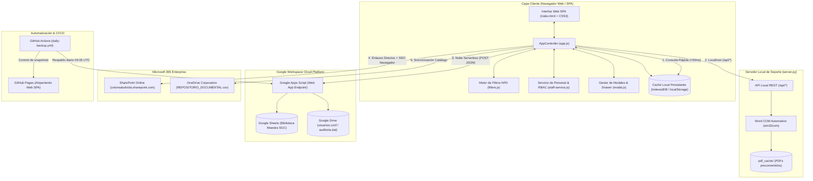

### 2.2. Diagrama de Cascada de Prioridad en la Adquisición de Datos

Para asegurar alta disponibilidad tanto en línea como fuera de línea, la adquisición de datos obedece a la siguiente jerarquía determinística:

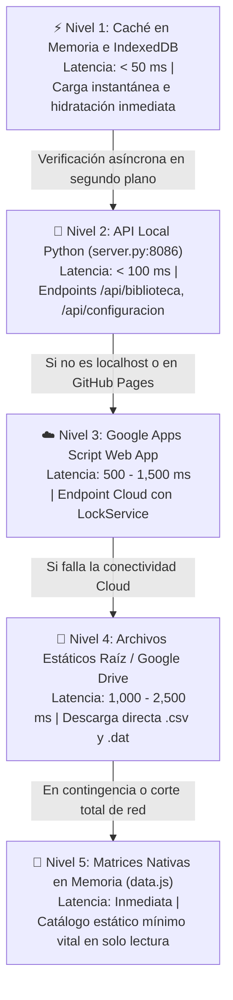

### 2.3. Matriz de Capas de Persistencia y Tiempos de Respuesta

| Nivel | Componente | Protocolo / API | Latencia | Modo Offline | Criterio de Activación |
| :---: | :--- | :--- | :---: | :---: | :--- |
| **Nivel 1** | `IndexedDB` / `localStorage` | Storage API | `< 50 ms` | **100% Offline** | Todo arranque de la SPA. |
| **Nivel 2** | `server.py` (`:8086`) | HTTP REST (`/api/*`) | `50 - 120 ms` | Parcial (Local) | Si `hostname === 'localhost'`. |
| **Nivel 3** | Apps Script Web App | HTTPS POST / JSON | `600 - 1,800 ms` | Requiere Red | En GitHub Pages con conexión. |
| **Nivel 4** | CSV/DAT Estáticos | Fetch HTTP GET | `800 - 2,500 ms` | Requiere Red | Falla en microservicio Cloud. |
| **Nivel 5** | `data.js` en memoria | ES6 Module | `0 ms (RAM)` | **100% Offline** | Contingencia total sin red ni caché. |

---

## 3. Inventario Canónico de Archivos y Persistencia de Datos

### 3.1. Matriz Canónica de Componentes del Sistema

| Archivo / Componente | Formato | Ubicación | Función Principal | Regla Operativa Clave |
| :--- | :--- | :--- | :--- | :--- |
| `REPOSITORIO_DOCUMENTAL.csv` | CSV (`;`) | Raíz / OneDrive | Enlaces físicos SharePoint | Filtrar carpetas sin extensión |
| `EMPLEADOS_ACTIVOS.csv` | CSV (`,`) | Raíz / Servidor | Matriz 1,305 empleados | Requiere estado `Activo` para ingresar |
| `Historico_Documentos_USV.csv` | CSV (`;`) | Raíz / Drive | Histórico de cambios SGC | Modelo estricto *Append-Only* |
| `usuarios.conf` | JSON | Raíz / Drive | Claves SHA-256 y perfiles | *Deep Merge* atómico con LockService |
| `auditoria.dat` | JSON | Raíz / Drive | Bitácora de telemetría | Excluye búsquedas; deduplicación 5-10s |
| `maestro.dat` | JSON | Raíz / Drive | Metadatos y taxonomía | Alimenta selectores de Tipos y Áreas |
| `google_drive_backup_script.gs`| GAS (V8) | Apps Script | Microservicio Cloud | Bloqueo exclusivo `LockService` (30s) |
| `daily-backup.yml` | GHA YAML | `.github/` | Respaldo 04:00 UTC | Snapshots inmutables en `backups/` |
| `server.py` | Python 3 | Raíz Local | API local y DOCX a PDF | Exclusión mutua `WORD_CONVERT_LOCK` |
| `index.html` | HTML5 | Raíz | Estructura SPA | Versionado estricto `?v=11.6.XX` |
| `styles.css` | CSS3 | Raíz | Diseño visual y temas | Vanilla CSS estricto (sin Tailwind) |
| `js/app.js` | ES6 | `js/` | Controlador principal | Coordinador de eventos e interfaz |
| `js/sharepoint-service.js` | ES6 | `js/` | SharePoint y OneDrive | Descargas y conversión PDF |
| `js/staff-service.js` | ES6 | `js/` | Seguridad y RBAC | Autenticación, bloqueo y auditoría |
| `js/filters.js` | ES6 | `js/` | Motor de búsqueda | Normalización NFD y filtros en cascada |
| `js/modal.js` | ES6 | `js/` | Modales y Drawer | Interacción y formularios |
| `js/analytics.js` | ES6 | `js/` | Dashboard SGC | Indicadores y semaforización |
| `js/cache-service.js` | ES6 | `js/` | IndexedDB Cache | Persistencia local resiliente |
| `js/data.js` | ES6 | `js/` | Respaldo estático | Catálogo de arranque rápido |
| `js/staff-data.js` | ES6 | `js/` | Respaldo estático | Personal de contingencia offline |

---

## 4. Jerarquía Documental: Documentos Base vs. Registros Derivados

### 4.1. Diagrama de Relación Jerárquica Padre-Hijo

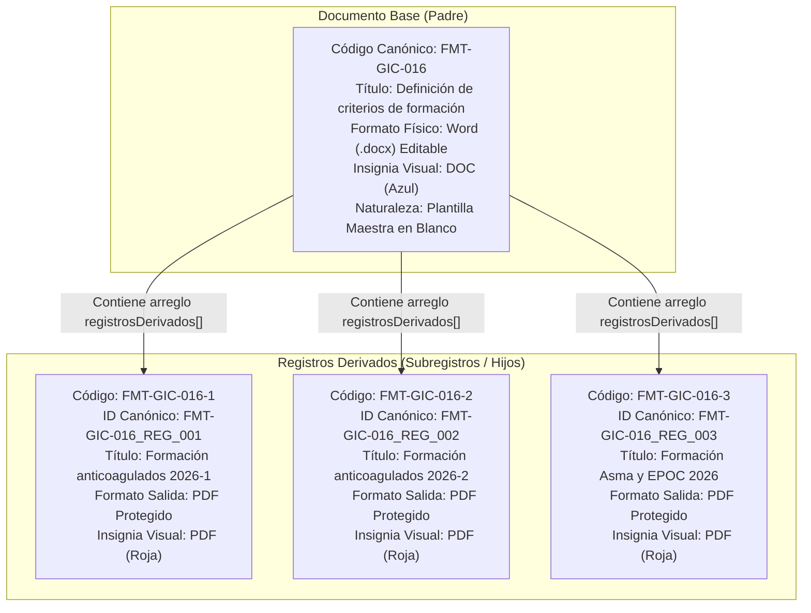

### 4.2. Matriz Comparativa: Documento Base vs. Registro Derivado

| Criterio | Documento Base (Padre) | Registro Derivado (Hijo) |
| :--- | :--- | :--- |
| **Código** | Sin sufijos secuenciales (`FMT-GIC-016`, `PRC-GMD-001`). | Con sufijo numérico (`-1`, `-2`) o `esRegistro === true`. |
| **Propósito** | Plantilla en blanco o directriz normativa institucional. | Registro diligenciado con información asistencial o clínica. |
| **Descarga (`📥`)** | **Word (.docx)** en formatos FMT; **PDF** en PRC/INS/MN. | **OBLIGATORIAMENTE PDF PROTEGIDO** (salvo `.xlsx`). |
| **Insignia UI** | `DOC` (Azul) en Word; `PDF` (Roja) en normativos; `XLS`. | **Siempre `PDF` (Roja)** o `XLS` si es hoja de cálculo. |
| **Clic en Fila** | Despliega / Oculta el acordeón de subregistros hijos. | Abre Drawer lateral con ficha técnica detallada. |
| **URL de Archivo** | Apunta al archivo maestro en SharePoint Online. | **JAMÁS** hereda URL del padre; requiere archivo propio. |
| **Búsqueda DOM** | Localizado por `doc.codigo`. | Búsqueda dual: `r.id === regId || r.codigo === regId`. |

### 4.3. Reglas de Integridad Estricta y Desvinculación de URLs
- **Vinculación Jerárquica:** Todo subregistro **DEBE** residir dentro del arreglo `base.registrosDerivados[]` de su documento padre.
- **Herencia de Metadatos:** Los registros derivados heredan automáticamente Área, Proceso, Tipo de Proceso y Carpeta de su padre.
- **Desvinculación Estricta de Archivos:** Un subregistro **JAMÁS** debe apuntar a la URL del archivo de su padre. Si no cuenta con archivo propio publicado en OneDrive/SharePoint, se marca como `NO DISPONIBLE`.
- **Identificador Único y Resolución Dual:** Todo subregistro posee una propiedad `id` inmutable (ej. `FMT-GIC-016_REG_002`). Los botones del DOM emiten `data-reg-id="${reg.id || reg.codigo}"` y los controladores resuelven el elemento mediante búsqueda dual: `r.id === regId || r.codigo === regId`.

---

## 5. Gestión de Identidad, Perfiles y Matriz de Acceso (RBAC)

### 5.1. Diagrama de Jerarquía de Perfiles

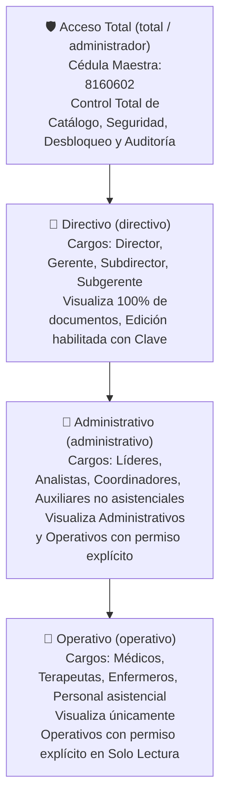

### 5.2. Diagrama de Flujo de Autenticación y Asignación de Perfil

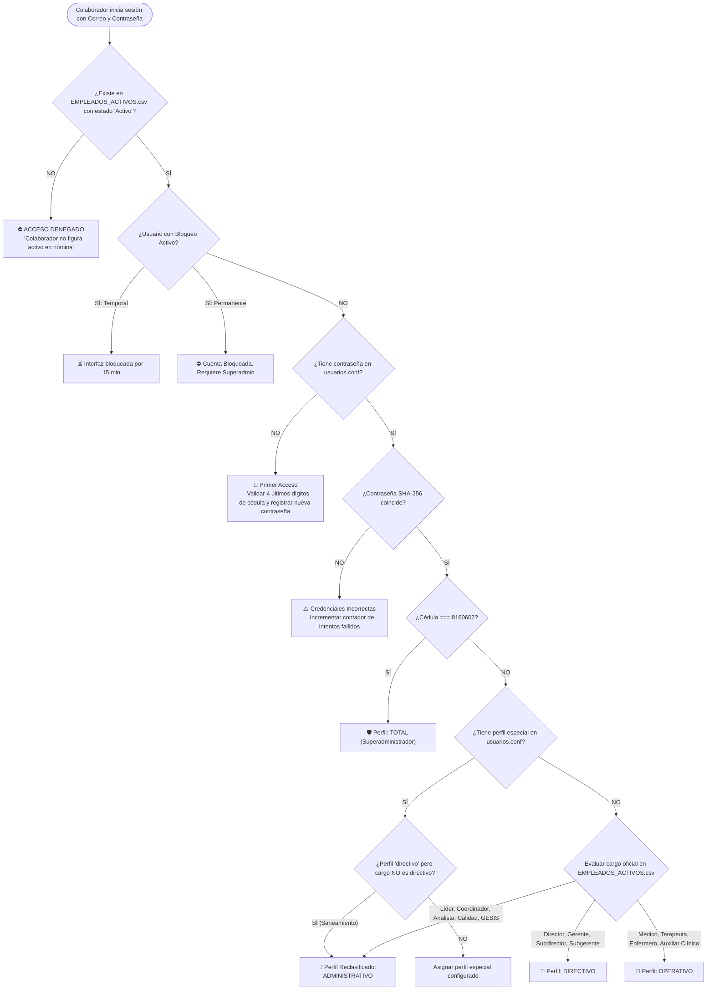

### 5.3. Matriz de Mapeo de Cargos y Regla de Saneamiento Directivo

| Perfil Resultante | Palabras Clave en Cargo | Regla de Saneamiento y Restricción |
| :---: | :--- | :--- |
| **`total`** | Cédula `8160602` (Superadministrador). | Asignación perpetua e inmutable por código fuente. |
| **`directivo`** | `director`, `directora`, `gerente`, `subdirector`, `subgerente`. | **Exclusividad Estricta:** Si no contiene estas palabras exactas, **se reclasifica a `administrativo`**. |
| **`administrativo`** | `lider`, `analista`, `coordinador`, `gesis`, `calidad`, `financiero`. | Gestión institucional con edición en sus propios procesos. |
| **`operativo`** | `medico`, `enfermero`, `terapeuta`, `auxiliar`, `odontologo`. | Personal asistencial. **Solo lectura estricta.** Sin edición ni dashboard. |

### 5.4. Matriz Exhaustiva de Capacidades por Perfil (RBAC)

| Capacidad / Función del Sistema | Total (`total`) | Directivo (`directivo`) | Administrativo (`administrativo`) | Operativo (`operativo`) |
| :--- | :---: | :---: | :---: | :---: |
| **Visualización en Catálogo** | 100% documentos | 100% documentos | Admin u Oper (`=== true`) | Únicamente Oper (`=== true`) |
| **Descarga Directa (`📥`)** | Habilitada | Habilitada | Habilitada | Habilitada (según matriz) |
| **Descarga Restringida** | Desbloqueable | Desbloqueable | Desbloqueable | **BLOQUEADO (`🔒`)** |
| **Activar Modo Edición** | **Automática** | Requiere Clave | Requiere Clave | **BLOQUEADO** |
| **Editar en SharePoint (`✏️`)** | Habilitada | Habilitada | Habilitada (en su proceso) | **DESHABILITADA** |
| **Abrir Carpeta (`📁`)** | Habilitada | Habilitada | Habilitada | **DESHABILITADA** |
| **Modificar Metadatos (`⚙️`)**| Habilitada | Habilitada | **Deshabilitada** | **DESHABILITADA** |
| **Retirar Doc (`🗑️` Soft-Delete)**| Habilitada | Habilitada | **DESHABILITADA** | **DESHABILITADA** |
| **Crear Documento (`➕`)** | Habilitada | Habilitada | **DESHABILITADA** | **DESHABILITADA** |
| **Dashboard Resumen** | Habilitada | Habilitada | Habilitada | **BLOQUEADA** |
| **Dashboard Calidad y Auditoría**| Habilitada | Habilitada | **OCULTA** | **BLOQUEADA** |
| **Exportar Excel / CSV** | Habilitada | Habilitada | **OCULTA** | **BLOQUEADA** |
| **Desbloquear Cuentas** | Habilitada | **Deshabilitada** | **Deshabilitada** | **Deshabilitada** |

---

## 6. Motor de Salida y Matriz Determinística de Descarga

### 6.1. Árbol de Decisión Determinística de Descarga

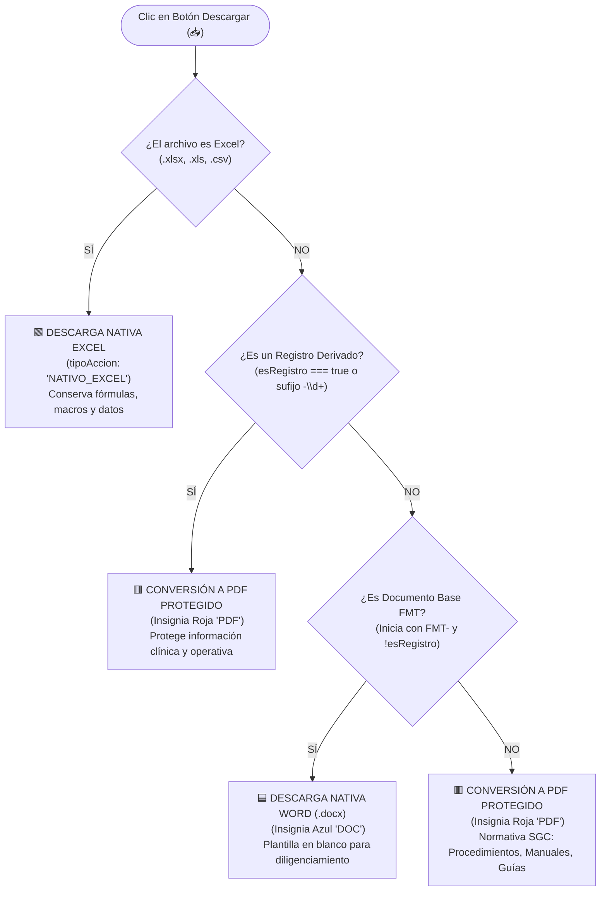

### 6.2. Matriz de Prefijos Oficiales y Formatos de Salida

| Prefijo Oficial | Tipo de Documento Institucional | Formato Base (Padre) | Formato Derivado (Hijo) | Justificación de Calidad |
| :---: | :--- | :---: | :---: | :--- |
| **`FMT-` / `FT-`** | Formato / Plantilla Institucional | **Word (.docx)** | **PDF Protegido** | Plantilla editable; registro diligenciado protegido. |
| **`PRC-` / `PR-`** | Procedimiento Institucional | **PDF Protegido** | **PDF Protegido** | Directriz normativa inalterable. |
| **`INS-` / `IN-`** | Instructivo Técnico | **PDF Protegido** | **PDF Protegido** | Instrucción técnica en solo lectura. |
| **`MN-`** | Manual Organizacional | **PDF Protegido** | **PDF Protegido** | Manual de calidad de consulta inmutable. |
| **`POL-` / `PT-`** | Política Corporativa | **PDF Protegido** | **PDF Protegido** | Política institucional vinculante. |
| **`GUA-` / `GU-`**| Guía Operativa / Práctica Clínica | **PDF Protegido** | **PDF Protegido** | Protocolo asistencial de estricto apego clínico. |
| **`PRG-` / `PG-`**| Programa de Gestión / Salud | **PDF Protegido** | **PDF Protegido** | Documento programático institucional. |
| **`DA-` / `DOC-`** | Documento Anexo | **PDF** (o Excel) | **PDF Protegido** | Soporte técnico o normativo complementario. |
| **`XLSX` / `XLS`** | Cualquier hoja de cálculo | **Excel Nativo** | **Excel Nativo** | Conservación de fórmulas, filtros y macros. |

### 6.3. Matriz de Casos Especiales y Manejo de Extensiones

| Caso Especial / Escenario | Comportamiento del Sistema | Acción en Interfaz de Usuario |
| :--- | :--- | :--- |
| **Caso Canónico `FMT-GIC-016`** | Debe descargar su archivo Word `.docx` original en blanco. **Bajo ninguna circunstancia debe abrir la carpeta de SharePoint**. | Botón `📥 Descargar` sirve archivo Word con insignia azul `DOC`. |
| **Subregistros `FMT-GIC-016-1`, `2`, `3`** | Aunque provienen de un formato `FMT`, contienen datos clínicos diligenciados. **Deben descargarse en PDF protegido**. | Botón `📥 Descargar` invoca conversión PDF y muestra insignia roja `PDF`. |
| **Carpetas de SharePoint (Sin Extensión)** | Las rutas correspondientes a carpetas de SharePoint **jamás deben reemplazar a un archivo descargable**. | El servicio excluye las carpetas del motor de descarga y las asigna exclusivamente al botón `📁 Abrir Carpeta`. |
| **Documentos con Descarga Restringida** | El documento se encuentra catalogado pero protegido contra descargas operativas no autorizadas. | Usuario operativo visualiza `🔒 Bloqueado`. Usuarios autorizados pueden desbloquear mediante Modo Edición. |

---

## 7. Experiencia de Usuario (UI/UX), Modos de Operación y Filtros

### 7.1. Diagrama de Estados: Modo Consulta vs. Modo Edición

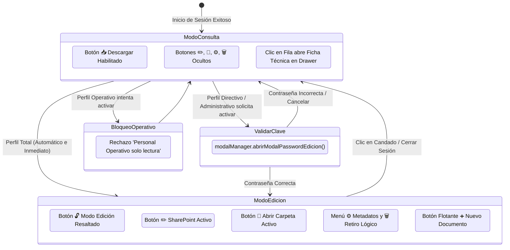

### 7.2. Diagrama de Flujo de Filtros en Cascada y Búsqueda NFD

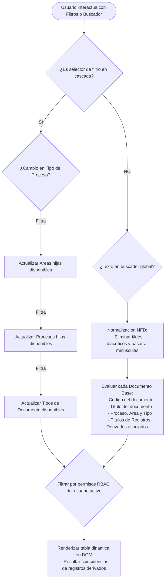

### 7.3. Matriz de Controles de Interfaz según Modo y Perfil

| Elemento de Control | Modo Consulta (`total`) | Modo Consulta (`dir` / `adm`) | Modo Consulta (`operativo`) | Modo Edición Activo (`total` / `dir` / `adm`) |
| :--- | :---: | :---: | :---: | :---: |
| **Botón `📥 Descargar`** | Visible y Activo | Visible y Activo | Visible y Activo | Visible y Activo |
| **Botón `✏️ SharePoint`**| Oculto | Oculto | Oculto | **Visible y Activo** |
| **Botón `📁 Carpeta`** | Oculto | Oculto | Oculto | **Visible y Activo** |
| **Menú `⚙️ Metadatos`** | Oculto | Oculto | Oculto | **Visible** (Solo `total` y `dir`) |
| **Botón `🗑️ Retirar`** | Oculto | Oculto | Oculto | **Visible** (Solo `total` y `dir`) |
| **Botón `➕ Nuevo Doc`** | Oculto | Oculto | Oculto | **Visible** (Solo `total` y `dir`) |
| **Dashboard Analítica**| Visible y Activo | Visible y Activo | **Bloqueada** | Visible y Activo |
| **Gestión de Perfiles** | Visible (Solo `total`)| Oculta | Oculta | Visible (Solo `total`) |

---

## 8. Telemetría, Auditoría Inmutable y Trazabilidad

### 8.1. Diagrama de Ingesta y Filtrado Anti-Flood de Telemetría

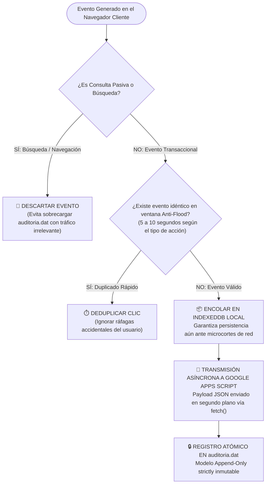

### 8.2. Matriz de Eventos Auditados en `auditoria.dat`

| Evento | Descripción y Atributos Registrados | Ventana Anti-Flood | Criticidad | Justificación de Seguridad |
| :---: | :--- | :---: | :---: | :--- |
| **`LOGIN`** | Identificación, Nombre, Cargo, Perfil, Dispositivo, Timestamp. | 10 s | Alta | Control de acceso y no-repudio. |
| **`DESCARGA`** | Código documental, Título, Extensión y Formato servido. | 5 s | Media | Trazabilidad del consumo documental. |
| **`EDICION`** | Apertura de documento para edición en SharePoint Online. | 5 s | Alta | Identificación del editor de contenidos. |
| **`CARPETA`** | Apertura del directorio de SharePoint desde la SPA. | 5 s | Baja | Auditoría de navegación estructural. |
| **`CREACION`** | Alta de documento base o registro derivado y autor. | Inmediato | **Crítica** | Control de versiones iniciales. |
| **`METADATOS`**| Cambio de versión, vigencia, custodia o retención. | Inmediato | **Crítica** | Integridad de la ficha técnica. |
| **`ELIMINACION`**| Retiro lógico (*Soft-Delete*) con justificación obligatoria. | Inmediato | **Crítica** | Trazabilidad legal del retiro. |
| **`SEGURIDAD`** | Registro, cambio de contraseña o desbloqueo de cuenta. | Inmediato | **Crítica** | Auditoría de identidades y accesos. |

---

## 9. Procesos Asíncronos, Respaldo y Automatización

### 9.1. Diagrama de Secuencia de Respaldo Diario Automatizado (GitHub Actions)

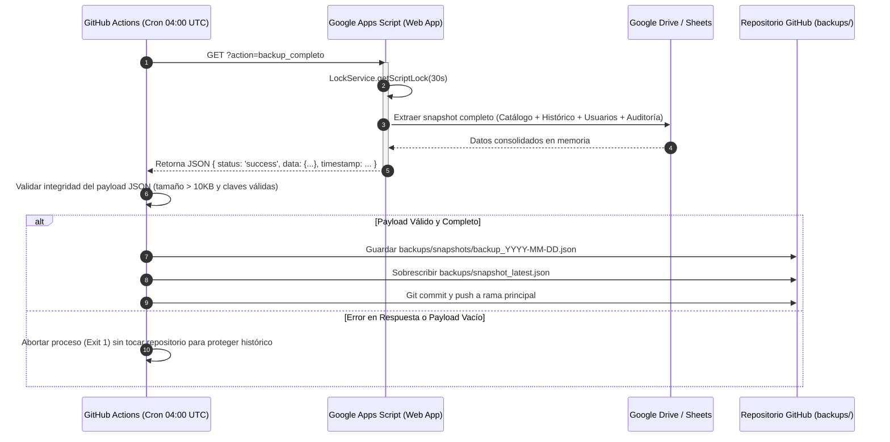

### 9.2. Diagrama de Concurrencia y Sincronización Cloud con LockService

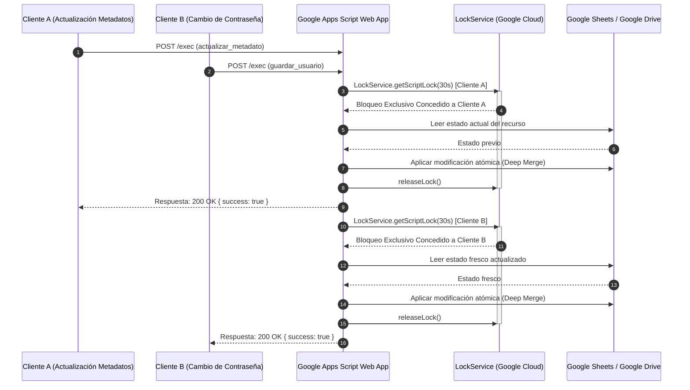

### 9.3. Matriz de Políticas de Respaldo y Retención

| Componente | Frecuencia | Mecanismo | Destino | Retención |
| :--- | :---: | :--- | :--- | :--- |
| **Snapshot Diario** | Diario (04:00 UTC) | GitHub Actions (`daily-backup.yml`) | Repositorio Git (`backups/snapshots/`) | Perpetua (Git). |
| **Snapshot Último** | Diario (04:00 UTC) | Sobrescritura controlada | `backups/snapshot_latest.json` | Estado más reciente. |
| **Control de Cambios** | En tiempo real | Apps Script Append | `Historico_Documentos_USV.csv` | Historial acumulativo. |
| **Auditoría de Seguridad**| En tiempo real | Apps Script Append | `auditoria.dat` | Bitácora inmutable. |

---

## 10. Políticas Oficiales de Seguridad y Decisiones de Negocio

### 10.1. Arquitectura de Autenticación Local con SSO de Navegador

#### Contexto Histórico y Decisión de Arquitectura
En fases tempranas de diseño se proyectó una integración interactiva mediante la biblioteca `MSAL.js` contra Microsoft Entra ID (Azure AD). Sin embargo, tras analizar las restricciones de licenciamiento, la incompatibilidad operativa en quioscos compartidos y las dificultades de registro de la aplicación en el tenant corporativo, **la Dirección y el Equipo de Desarrollo formalizaron el Modelo de Autenticación Local Oficial**.

#### Directrices Vigentes:
1. **Autoridad de Identidad Local:** La identidad del colaborador se autentica exclusivamente mediante `staff-service.js` validando contra `EMPLEADOS_ACTIVOS.csv` y contraseñas hash SHA-256 en `usuarios.conf`.
2. **Acceso Federado Pasivo (SSO Navegador):** Al hacer clic en enlaces de edición colaborativa (`✏️`) o carpetas (`📁`) de SharePoint Online, la SPA redirige o abre una nueva pestaña en `unionsaludvida.sharepoint.com`, aprovechando la sesión activa de Microsoft 365 que el colaborador ya posee en su navegador web.
3. **Decomisionamiento Permanente:** El artefacto legado `js/auth.js` y cualquier código asociado a la autenticación MSAL/Azure ha sido **oficialmente eliminado y dado de baja** del repositorio.

#### Diagrama 10.1.1: Flujo de Autenticación Local y Acceso Federado M365

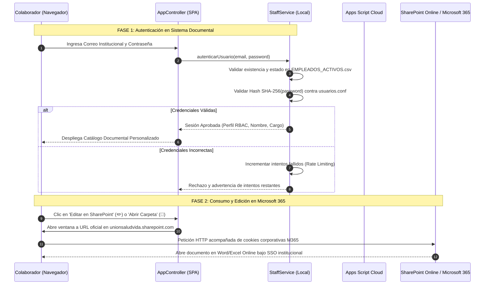

#### Tabla 10.1.1: Comparativa Modelo Local Oficial vs. Modelo MSAL Deprecado

| Atributo Arquitectónico | Modelo Local Oficial Vigente | Modelo MSAL / Azure (Deprecado) |
| :--- | :--- | :--- |
| **Componente de Software** | `js/staff-service.js` (Modular ES6) | `js/auth.js` (**ELIMINADO**) |
| **Validación de Personal** | Matriz `EMPLEADOS_ACTIVOS.csv` (1,305 empleados). | Tenant de Azure Active Directory / Entra ID. |
| **Almacenamiento Claves** | Hash criptográfico SHA-256 en `usuarios.conf`. | Tokens JWT / OAuth2 administrados por Microsoft. |
| **Dependencia Tenant** | **Ninguna.** Autonomía total del aplicativo. | Crítica. Bloqueado por restricciones de tenant. |
| **Acceso a SharePoint** | Enlace directo federado vía SSO pasivo de navegador. | Redirección interactiva con popups y tokens. |
| **Resiliencia Offline** | Alta (valida credenciales cacheadas localmente). | Nula (falla inmediatamente sin conexión a Azure). |

---

### 10.2. Política de Mínimo Privilegio y Denegación por Defecto (Default Deny)

#### Directriz Oficial:
Si en la hoja de cálculo maestra de Google Sheets las columnas de permisos `Directivo`, `Administrativo` u `Operativo` se encuentran en blanco, con espacios o vacías, la política de seguridad corresponde de forma estricta a **DENEGACIÓN POR DEFECTO (`false`)**.

#### Reglas de Evaluación:
1. **Concesión Explícita Únicamente:** Solo la presencia exacta del caracter `'X'` (o valores afirmativos normalizados `'SI'`, `'TRUE'`, `'1'`) otorga permiso afirmativo (`true`).
2. **Evaluación Booleana Estricta:** Las cláusulas del código deben usar operadores de igualdad estricta (`=== true`). Quedan terminantemente prohibidas cláusulas permisivas como `!== false`.
3. **Visibilidad por Perfil:**
   - **Perfil Directivo:** Visualiza el 100% de los documentos activos.
   - **Perfil Administrativo:** Requiere estrictamente `d.permisoAdministrativo === true || d.permisoOperativo === true`.
   - **Perfil Operativo:** Requiere estrictamente `d.permisoOperativo === true`.

#### Diagrama 10.2.1: Árbol Lógico de Evaluación de Permisos en Hoja de Cálculo

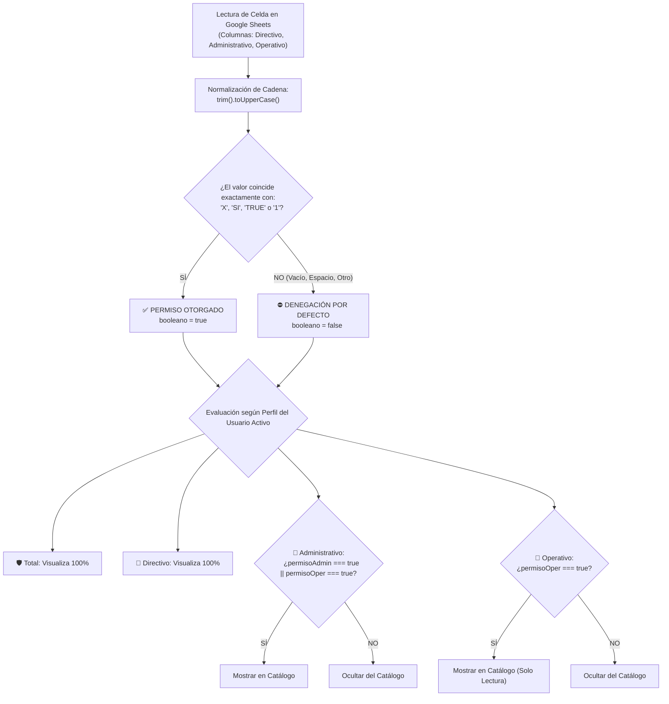

#### Tabla 10.2.1: Tabla de Verdad y Visibilidad según Celda y Perfil

| Valor en Celda | Booleano | Perfil Total | Perfil Directivo | Perfil Administrativo | Perfil Operativo |
| :---: | :---: | :---: | :---: | :---: | :---: |
| `'X'` / `'x'` | `true` | Visible | Visible | Visible | Visible (si en col Operativo) |
| `'SI'` / `'si'` | `true` | Visible | Visible | Visible | Visible (si en col Operativo) |
| `[En Blanco]` | **`false`** | Visible | Visible | **Oculto** (si no tiene otra col) | **Oculto** |
| `[Espacios]` | **`false`** | Visible | Visible | **Oculto** | **Oculto** |
| `'NO'` / `'0'` | **`false`** | Visible | Visible | **Oculto** | **Oculto** |
| *Cualquier otro* | **`false`** | Visible | Visible | **Oculto** | **Oculto** |

---

### 10.3. Prohibición de Borrado Físico y Retiro Lógico (Soft-Delete)

#### Directriz Oficial:
El borrado físico de filas en la hoja maestra de Google Sheets está **estrictamente prohibido por políticas de calidad en salud**.

#### Mecanismo de Retiro Lógico (*Soft-Delete*):
- Al retirar un documento base o subregistro, el sistema actualiza su estado a `Eliminado` u `Obsoleto`.
- Se exige de forma obligatoria el ingreso de una **justificación detallada** del retiro.
- El evento se registra en el histórico inmutable (`Historico_Documentos_USV.csv`) y en `auditoria.dat`.
- El parámetro de borrado físico en el código queda permanentemente fijado en `borradoFisico: false`.

#### Diagrama 10.3.1: Ciclo de Vida Documental y Retiro Lógico

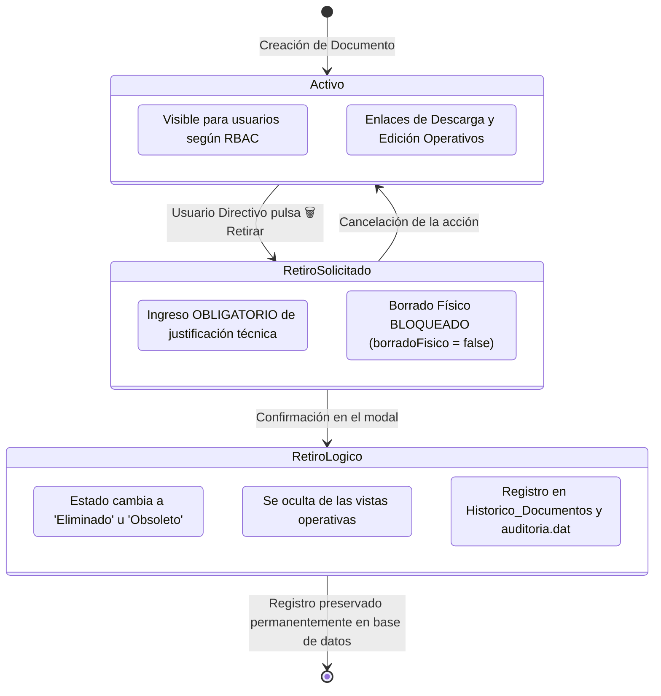

#### Tabla 10.3.1: Matriz Diferencial: Retiro Lógico vs. Borrado Físico Prohibido

| Criterio Técnico / Legal | Retiro Lógico (*Soft-Delete* - Vigente) | Borrado Físico (*Purga* - Prohibido) |
| :--- | :--- | :--- |
| **Acción en Sheets** | Actualiza columna `Estado` a `Eliminado` u `Obsoleto`. | Elimina físicamente la fila (`deleteRow`). |
| **Historial SGC** | **100% Preservado.** Trazabilidad completa garantizada. | Destruye el registro y rompe la auditoría. |
| **Normativa Salud** | Conforme con el Sistema de Calidad en Salud. | **No conforme.** Incumple entes de control. |
| **Justificación** | Exigida obligatoriamente en modal antes de procesar. | No aplicable (eliminación sin rastro). |
| **Recuperabilidad** | Reversible reactivando el estado por administrador. | Irreversible sin restauración compleja de backups. |
| **Control en Código** | Parámetro `borradoFisico = false` forzado en `modal.js`. | Checkbox de purga física **eliminado de la UI**. |

---

### 10.4. Tasa Límite (Rate Limiting) y Bloqueo Escalonado

#### Directriz Oficial:
Para salvaguardar la integridad de las cuentas y prevenir ataques de fuerza bruta o suplantación de identidad:
- **Nivel 1 (Bloqueo Temporal de Interfaz):** Tras **3 intentos fallidos consecutivos** de ingreso o cambio de contraseña, la interfaz se bloquea temporalmente por **15 minutos**.
- **Nivel 2 (Bloqueo Permanente de Cuenta):** Si un mismo usuario acumula **3 bloqueos temporales consecutivos**, su cuenta pasa a estado de **Bloqueo Permanente**.
- **Nivel 3 (Desbloqueo Exclusivo de Superadministrador):** La única persona facultada para desbloquear una cuenta bloqueada de forma permanente es el usuario con perfil **Acceso Total (Cédula 8160602)** desde el módulo de personal.

#### Diagrama 10.4.1: Flujo de Bloqueo Escalonado por Intentos Fallidos

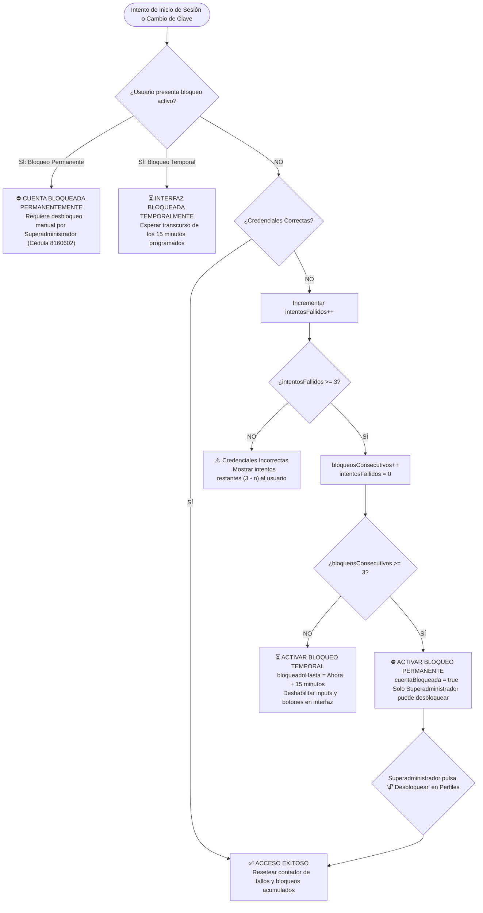

#### Tabla 10.4.1: Matriz de Estados de Seguridad y Reglas de Desbloqueo

| Estado de Seguridad | Condición de Disparo | Impacto en Interfaz | Duración | Procedimiento de Desbloqueo |
| :---: | :--- | :--- | :---: | :--- |
| **Normal (Activo)** | 0 a 2 fallos. | Interfaz totalmente funcional. | Indefinida. | No requerido. Acceso normal. |
| **Bloqueo Nivel 1** | 3 fallos consecutivos. | Banner advertencia; inputs deshabilitados. | **15 min** | Automático al expirar el tiempo. |
| **Bloqueo Nivel 2** | 3 fallos tras cumplir nivel 1. | Banner advertencia; inputs deshabilitados. | **15 min** | Automático al expirar el tiempo. |
| **Bloqueo Permanente** | Acumulación de **3 bloqueos**. | Acceso denegado; badge `🔒 Bloqueado`. | **Perpetuo** | **Solo Superadministrador (8160602)**. |

---

## 11. Decálogo de Gobernanza para Desarrolladores

### 11.1. Tabla Maestra de Mandamientos Técnicos y Sanción por Violación

| # | Mandamiento Técnico | Justificación Técnica | Módulos Afectados | Sanción por Incumplimiento |
| :-: | :--- | :--- | :--- | :--- |
| **1** | **FORMATO SUBREGISTROS:** Ningún derivado en Word. Todos en PDF protegido (salvo `.xlsx`). | Protección de datos clínicos diligenciados. | `sharepoint-service`, `modal` | Sanción de Calidad: Fuga de datos editables. |
| **2** | **CANÓNICO FMT-GIC-016:** Documento base descarga `.docx` en blanco. Jamás abre carpeta. | Plantilla maestra para diligenciamiento. | `sharepoint-service`, `app` | Error UX: Apertura indebida de carpeta. |
| **3** | **RESTRICCIÓN OPERATIVO:** Perfil Operativo jamás accede a botones de edición ni Dashboard. | Mínimo Privilegio y segregación de funciones. | `modal.js`, `analytics.js` | Brecha Seguridad: Alteración no autorizada. |
| **4** | **HASH DE CONTRASEÑAS:** Toda contraseña en `usuarios.conf` se hashea con SHA-256. | Protección criptográfica de credenciales. | `staff-service.js`, GAS | Brecha Crítica: Compromiso de contraseñas. |
| **5** | **BLOQUEO COM WORD:** `server.py` mantiene exclusión mutua `WORD_CONVERT_LOCK`. | Word COM no es thread-safe en Windows. | `server.py` | Fallo de Sistema: Cuelgue de `WINWORD.EXE`. |
| **6** | **DEFAULT DENY EN SHEETS:** Celdas vacías = `false`. Solo `'X'` otorga permiso explícito. | Mínimo Privilegio. Evita fuga de documentos. | `filters.js`, Apps Script | Brecha Privacidad: Acceso no autorizado. |
| **7** | **PROHIBICIÓN BORRADO FÍSICO:** Prohibida purga de filas. Todo retiro es *Soft-Delete*. | Inmutabilidad y trazabilidad legal SGC. | `modal.js`, Apps Script | Violación Legal: Pérdida de histórico. |
| **8** | **TASA LÍMITE Y BLOQUEO:** 3 fallos = 15 min; 3 bloqueos = permanente; desbloqueo Superadmin. | Prevención de ataques de fuerza bruta. | `staff-service.js`, `modal` | Vulnerabilidad: Exposición de cuentas. |
| **9** | **AUTENTICACIÓN LOCAL:** Modelo Local Oficial con SSO de navegador. `auth.js` eliminado. | Autonomía técnica ante bloqueos de Azure. | `staff-service.js`, `index` | Inestabilidad: Errores de token en Azure. |
| **10**| **RESOLUCIÓN DUAL:** Registros derivados se resuelven por `r.id === id \|\| r.codigo === id`. | Consistencia en el DOM ante nombres dispares. | `app.js`, `modal.js` | Error Funcional: Drawer/botones no responden. |

### 11.2. Resumen Nemotécnico para el Desarrollador

```
================================================================================
           DECÁLOGO DE GOBERNANZA TÉCNICA Y ARQUITECTÓNICA (SSOT)
================================================================================
1. FORMATO DE SUBREGISTROS:
   NINGÚN registro derivado debe descargarse en Word.
   TODOS los registros derivados deben descargarse en PDF protegido (insignia roja PDF),
   a menos que sean hojas de cálculo (.xlsx).

2. CASO CANÓNICO FMT-GIC-016:
   El documento base FMT-GIC-016 DEBE descargar su archivo .docx original.
   NO DEBE abrir la carpeta de SharePoint.

3. RESTRICCIÓN OPERATIVA:
   El perfil Operativo JAMÁS debe tener acceso a botones de edición ni al Dashboard.

4. CRIPTOGRAFÍA DE CONTRASEÑAS:
   Las contraseñas en usuarios.conf SIEMPRE se hashean en SHA-256 antes de guardarse.

5. BLOQUEO COM EN CONVERSIÓN:
   El servidor local server.py debe mantener activo el bloqueo WORD_CONVERT_LOCK
   en toda conversión para garantizar estabilidad en Windows.

6. PERMISOS EN GOOGLE SHEETS (DEFAULT DENY):
   Columnas en blanco en Directivo, Administrativo u Operativo = DENEGACIÓN POR DEFECTO.
   Únicamente la presencia explícita de 'X' concede permiso de visualización o edición.

7. PROHIBICIÓN DE BORRADO FÍSICO (SOFT-DELETE):
   Queda estrictamente PROHIBIDO el borrado físico de filas en Google Sheets.
   Todo retiro debe ser un retiro lógico (Soft-Delete) a 'Eliminado' u 'Obsoleto'.

8. TASA LÍMITE Y BLOQUEO ESCALONADO:
   3 intentos fallidos = 15 minutos de bloqueo temporal.
   3 bloqueos temporales consecutivos = Bloqueo permanente de cuenta.
   Desbloqueo condicionado exclusivamente a Superadministradores (Acceso Total).

9. ARQUITECTURA DE AUTENTICACIÓN OFICIAL:
   Modelo Local Oficial (staff-service.js contra EMPLEADOS_ACTIVOS.csv y usuarios.conf)
   con SSO federado por navegador hacia SharePoint. El componente legado auth.js
   queda formalmente dado de baja y eliminado.

10. RESOLUCIÓN DUAL DE SUBREGISTROS:
    Todo registro derivado DEBE tener un ID canónico y resolverse mediante búsqueda
    dual (r.id === regId || r.codigo === regId) para garantizar funcionalidad en el DOM.
================================================================================
```
